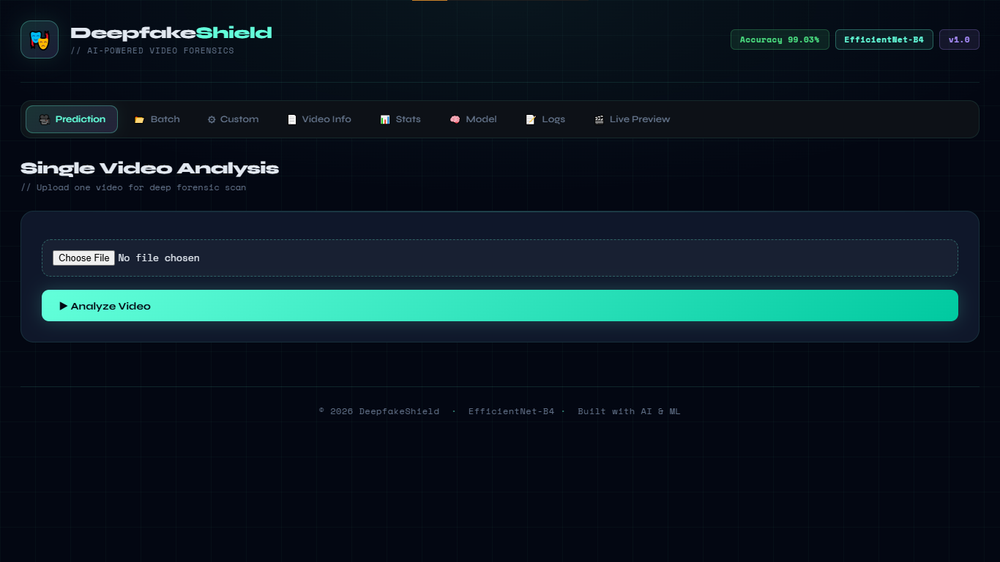
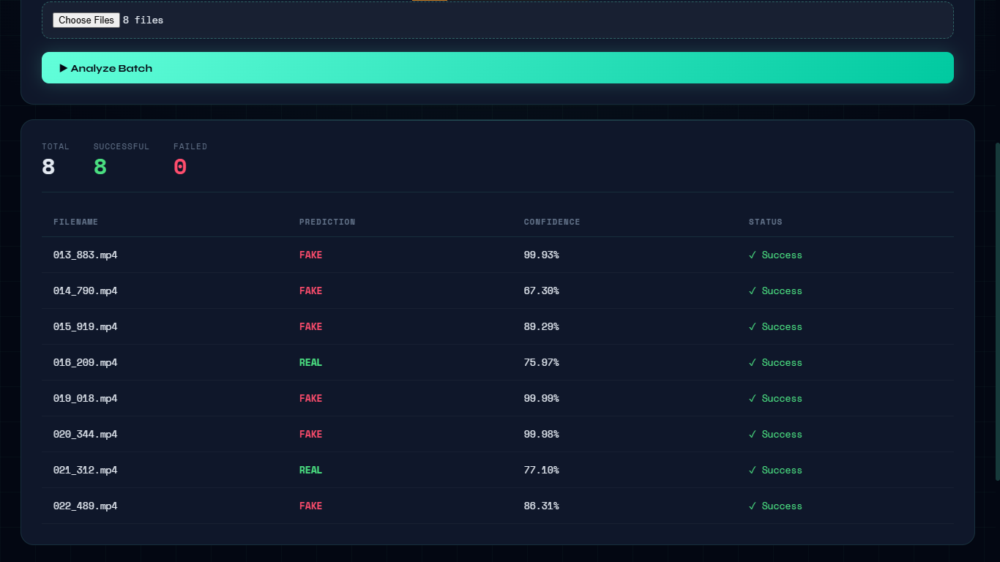
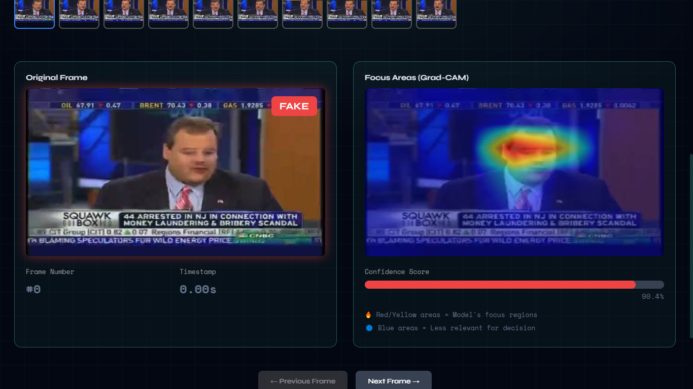
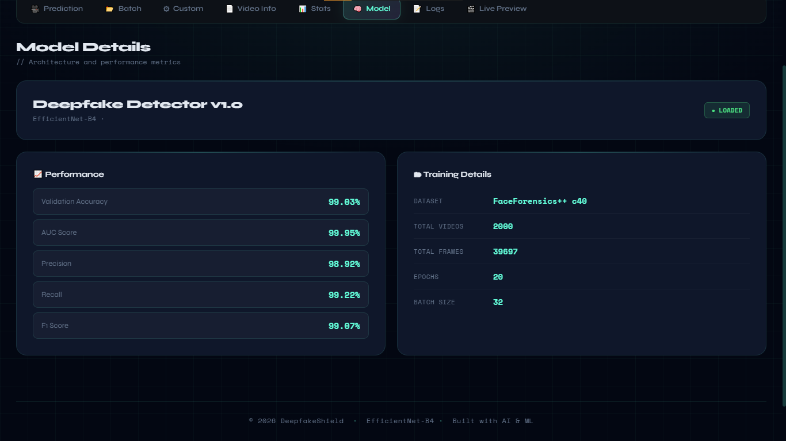
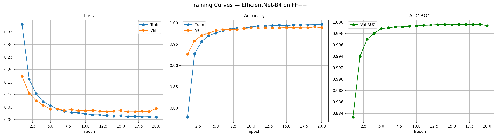
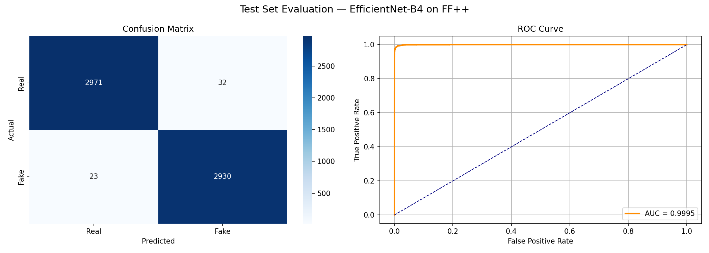

# DeepfakeShield 🎭
### AI-Powered Video Forensics



> A full-stack deepfake detection web application powered by **EfficientNet-B4**, trained on the **FaceForensics++ c40** dataset. Upload a video and get a real-time prediction with confidence scores, frame-level analysis, and Grad-CAM heatmaps showing exactly where the model is looking.

---

## Performance

| Metric | Score |
|--------|-------|
| Test Accuracy | **99.08%** |
| AUC-ROC | **99.95%** |
| Precision | **98.92%** |
| Recall | **99.22%** |
| F1 Score | **99.07%** |

Evaluated on a held-out test set of **5,956 frames** never seen during training.

---

## Screenshots

**Single Video Prediction**


**Batch Analysis**



**Live Frame-by-Frame Analysis with Grad-CAM**



**Model Info**



---

## Training Results

**Training Curves**



**Test Set Evaluation — Confusion Matrix & ROC Curve**



---

## How It Works

1. User uploads a video through the React frontend
2. Flask backend samples 10 evenly spaced frames from the video
3. Each frame is passed through EfficientNet-B4
4. Frame-level sigmoid scores are averaged into a final prediction
5. Grad-CAM heatmaps highlight the facial regions the model focused on

---

## Tech Stack

**Backend**
- Python, Flask, PyTorch
- EfficientNet-B4 (transfer learning from ImageNet)
- OpenCV for frame extraction
- Grad-CAM for explainability
- Waitress (production WSGI server)

**Frontend**
- React, Vite
- Served via Flask static build

**Training**
- Google Colab (Tesla T4 GPU)
- FaceForensics++ c40 dataset (2000 videos, 39,697 frames)
- AdamW optimizer, ReduceLROnPlateau scheduler
- Data augmentation: HorizontalFlip, ColorJitter, RandomRotation
- Early stopping with patience=5

---

## Dataset

Trained on [FaceForensics++](https://github.com/ondyari/FaceForensics) c40 compression:
- 1000 original YouTube videos (real)
- 1000 Deepfakes manipulated videos (fake)
- 70/15/15 train/val/test split
- Face cropping with Haar cascade before training

---

## Project Structure

```
DeepfakeShield/
├── Logic/                        # Flask backend
│   ├── app.py                    # Main Flask app, API endpoints
│   ├── data/
│   │   └── models/
│   │       ├── inference.py      # DeepfakeDetector + inference class
│   │       └── ff_efficientnet_b4_FINAL.json  # Model metadata
│   ├── live_analysis.py          # Frame-by-frame Grad-CAM blueprint
│   └── requirements.txt
├── my-react-app/                 # React frontend
│   ├── src/
│   │   ├── components/
│   │   │   ├── Header.jsx
│   │   │   ├── Prediction.jsx
│   │   │   ├── Batch.jsx
│   │   │   ├── Custom.jsx
│   │   │   ├── LivePreview.jsx
│   │   │   ├── Model.jsx
│   │   │   ├── Stats.jsx
│   │   │   ├── Logs.jsx
│   │   │   └── VideoInfo.jsx
│   │   └── App.jsx
│   └── dist/                     # React production build
└── training/
    ├── FF_Plus_Training.py       # Full training script
    └── extract_frames.py         # Frame extraction with face cropping
```

---

## Setup & Installation

### Prerequisites
- Python 3.10+
- Node.js 18+
- ~500MB free disk space for the model

### 1. Clone the repository
```bash
git clone https://github.com/musab855/DeepfakeShield.git
cd DeepfakeShield
```

### 2. Download the model
The model file is too large for GitHub. Download it from Google Drive:

**[Download ff_efficientnet_b4_FINAL.pth](https://drive.google.com/file/d/14FDYVsqIetrBVjabKjb3qrwc5CCLgSqa/view?usp=sharing)**

Place it at:
```
Logic/data/models/ff_efficientnet_b4_FINAL.pth
```

### 3. Install Python dependencies
```bash
cd Logic
pip install -r requirements.txt
```

### 4. Run the app
```bash
python app.py
```

Visit `http://127.0.0.1:5000`

---

## API Endpoints

| Endpoint | Method | Description |
|----------|--------|-------------|
| `/` | GET | React web interface |
| `/predict` | POST | Single video prediction |
| `/predict-batch` | POST | Batch video prediction (max 10) |
| `/predict-custom` | POST | Predict with custom threshold and frame count |
| `/video-info` | POST | Extract video metadata |
| `/model-info` | GET | Model architecture and performance metrics |
| `/stats` | GET | API usage statistics |
| `/logs` | GET | Recent prediction logs |
| `/analyze-live` | POST | Frame-by-frame analysis with Grad-CAM |

---

## Reproduce Training

Frame extraction and training scripts are in the `training/` folder.

```bash
# 1. Extract faces from FF++ videos
python training/extract_frames.py

# 2. Upload frames/ to Google Drive
# 3. Open training/FF_Plus_Training.py in Google Colab
# 4. Set runtime to T4 GPU and run top to bottom
```

---

## Limitations

- Model is trained on FaceForensics++ Deepfakes manipulation method only. Performance may vary on other deepfake generation methods (Face2Face, FaceSwap, NeuralTextures) or heavily compressed real-world videos.
- Inference runs on CPU by default. For faster inference, change `device='cpu'` to `device='cuda'` in `app.py` if a GPU is available.

---

## Author

**Musab Salmani**
- GitHub: [@musab855](https://github.com/musab855)
- LinkedIn: [musab-salmani-497150325](https://linkedin.com/in/musab-salmani-497150325)
- Email: musabasif5@gmail.com

---

## License

This project is for educational and research purposes. The FaceForensics++ dataset is subject to its own [Terms of Use](http://kaldir.vc.in.tum.de/faceforensics/webpage/FaceForensics_TOS.pdf).
